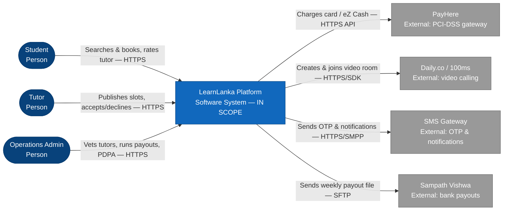

# LearnLanka — C4 System Context Diagram (companion notes)

> **Author:** Buddhika Amarasinghe
> The gradeable source is **`buddhika-day1-context-diagram.drawio`**. Open it in
> [app.diagrams.net](https://app.diagrams.net) → **File → Export as → PNG** to
> produce `buddhika-day1-context-diagram.png`. This file is the text + Mermaid
> sketch for quick review.

## 1. Textual sketch (built first, per the brief's hint)

```
[Student]        -- searches & books sessions, rates tutor (HTTPS) -->  ( LearnLanka Platform )
[Tutor]          -- publishes slots, accepts/declines bookings (HTTPS) ->( LearnLanka Platform )
[Ops Admin]      -- vets tutors, runs payouts, handles PDPA (HTTPS) --->  ( LearnLanka Platform )

( LearnLanka Platform ) -- charges card / eZ Cash (HTTPS API) -------> [PayHere]
( LearnLanka Platform ) -- creates & joins video room (HTTPS/SDK) ---> [Daily.co / 100ms]
( LearnLanka Platform ) -- sends OTP & notifications (HTTPS/SMPP) ----> [SMS Gateway]
( LearnLanka Platform ) -- sends weekly payout file (SFTP) ----------> [Sampath Vishwa]
```

## 2. Mermaid view



## 3. Legend

| Notation | Meaning |
|----------|---------|
| Blue stick figure | **Person** — an actor/role using the system |
| Dark-blue rounded box (centre) | **System in scope** — the LearnLanka Platform (the only one) |
| Grey rounded box | **External system** — a third party we integrate with but don't build |
| Labelled arrow | **Relationship** — reads as *verb + [protocol/channel]* |

## 4. Minimum-functionality checklist

- [x] Three person actors present and labelled with role (Student, Tutor, Ops Admin)
- [x] LearnLanka Platform is the only "system in scope" box
- [x] At least four external systems shown (PayHere, Daily.co/100ms, SMS Gateway, Sampath Vishwa)
- [x] Every arrow has a verb-led label and an indication of protocol/channel
- [x] A short legend explains the notation used
