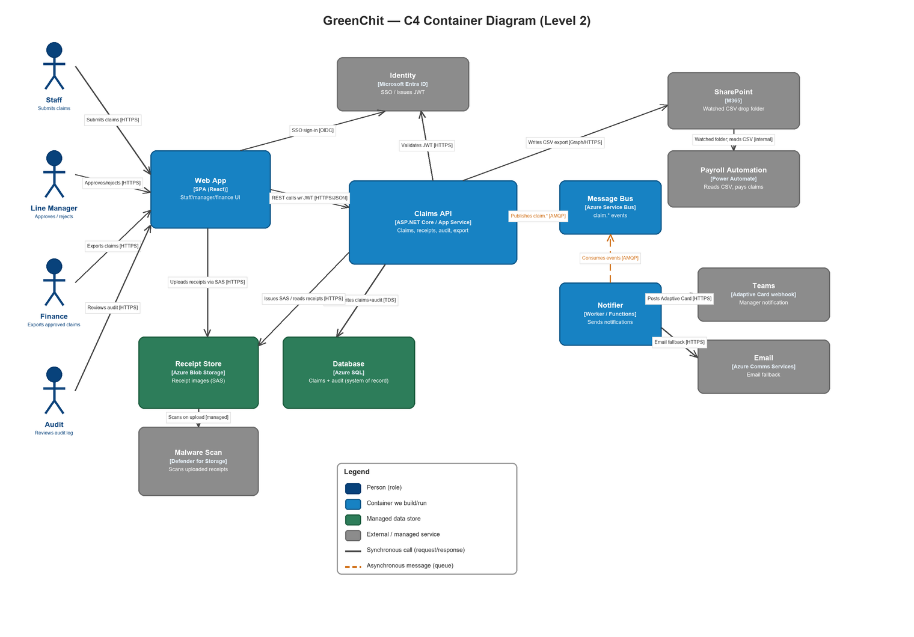
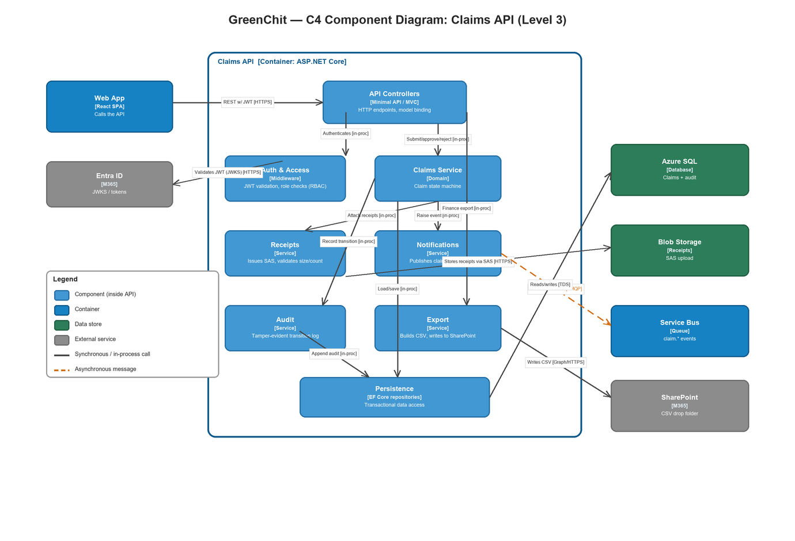

# GreenChit — Architecture Design Pack

> **Author:** Buddhika Amarasinghe
> **Date:** 2026-06-10
> GreenChit is an internal BISTEC tool for staff reimbursement claims: submit with
> receipts → manager approval → finance CSV export to payroll, with a 7-year
> tamper-evident audit trail.

---

## 1. System Context

Every BISTEC staff member is a **claimant**; their **line manager** approves or
rejects; **finance** exports approved claims; an **audit** role can read any claim
for compliance. Staff submit a claim (category, date, LKR amount, description, 1–5
receipt images) through a web app, signing in with their existing **Microsoft Entra
ID** account. The system notifies the manager in **Microsoft Teams** (email
fallback), records **every state transition** (who/when/why) in a tamper-evident log
kept for **7 years**, and drops approved-claim **CSV exports into a SharePoint folder**
that the payroll automation watches. Receipts live in **Blob Storage** behind
signed URLs and are malware-scanned. The only people who may view a given claim are
its claimant, that claimant's line manager, finance, and audit.

---

## 2. Containers (C4 Level 2)

| Container | Technology | Responsibility |
|-----------|------------|----------------|
| Web App | React SPA (static, on App Service / Static Web Apps) | UI for staff, manager, finance, audit; handles Entra sign-in; uploads receipts directly to Blob via SAS |
| Claims API | ASP.NET Core on **Azure App Service** | The system: claim lifecycle, RBAC, receipt SAS issuance, audit writes, CSV export; publishes events |
| Notifier | Worker / Azure Functions | Consumes `claim.*` events; posts Teams Adaptive Card; sends email fallback |
| Message Bus | Azure Service Bus | Decouples notification (and future) work from the request path |
| Database | Azure SQL | System of record: claims, state, and the append-only audit log |
| Receipt Store | Azure Blob Storage | Receipt images, written/read via short-lived **SAS** URLs |
| Malware Scan | Microsoft Defender for Storage | Scans every uploaded receipt before it is viewable |
| Identity | Microsoft Entra ID (BISTEC tenant) | SSO; issues/validates JWTs |
| Teams | Adaptive Card webhook | Manager approval notification |
| Email | Azure Communication Services | Email fallback when Teams delivery fails |
| SharePoint | Microsoft 365 | Watched folder that receives the approved-claims CSV |
| Payroll Automation | Power Automate | Reads the CSV and pays claims |

**Notation:** blue = containers we build/run · green = managed data stores · grey =
external/managed services · **solid arrow = synchronous** request/response · **orange
dashed arrow = asynchronous** queue message. Every arrow is labelled *verb + [protocol]*.

---

## 3. Components (C4 Level 3) — Claims API

| Component | Technology | Responsibility |
|-----------|------------|----------------|
| API Controllers | Minimal API / MVC | HTTP endpoints, model binding, validation, status codes |
| Auth & Access | ASP.NET middleware | Validates the Entra JWT (issuer/audience/expiry) and enforces **RBAC** — claimant vs manager vs finance vs audit, plus per-claim ownership |
| Claims Service | Domain service | The **state machine**: Draft → Submitted → Approved/Rejected → Paid; enforces legal transitions |
| Receipts | Service | Issues short-lived **SAS** upload URLs, validates ≤ 10 MB × ≤ 5 files, links receipts to a claim, reacts to scan result |
| Notifications | Service | Raises domain events and **publishes `claim.*`** to Service Bus (never calls Teams inline) |
| Audit | Service | Writes the **tamper-evident** transition record (who/when/why) on every change |
| Export | Service | Builds the finance CSV and writes it to the SharePoint folder |
| Persistence | EF Core repositories | Transactional data access to Azure SQL (claims + audit in one transaction) |

The notation is **identical** to the container level (same colours, same solid/dashed
convention); externals (Web App, Entra, SQL, Blob, Service Bus, SharePoint) appear as
boxes outside the dashed **Claims API** boundary.

---

## 4. Reading order (for a reviewer)

1. **Start with §1 System Context** — understand *who* uses GreenChit and the four
   roles, because the whole privacy/RBAC model hangs off them.
2. **Then the Container diagram (§2)** left-to-right: actors → **Web App** → **Claims
   API** (the hub). Note that receipts are uploaded **directly to Blob via SAS**, not
   through the API — follow that vertical arrow.
3. **Trace the two flow types in the Container diagram:** the **solid** path is the
   synchronous submit/approve request; the **orange dashed** path is the async
   `claim.*` event → **Notifier** → Teams/Email. This is where reliability lives.
4. **Follow the data downward:** Claims API → **Azure SQL** (claims + audit together)
   and the finance path Claims API → **SharePoint** → **Payroll**.
5. **Zoom in with the Component diagram (§3):** open the **Claims API** box and read
   it top-down — **Controllers** receive the call, **Auth & Access** gates it,
   **Claims Service** runs the state machine and fans out to **Receipts /
   Notifications / Audit / Export**, all persisting through **Persistence**.
6. **Finally read the sequence diagram** (`diagrams/sequence-submit-approve.md`) to
   see these components interact over time on the submit-and-approve journey,
   including the receipt-upload error path. Lifeline names there match these
   container names exactly.
