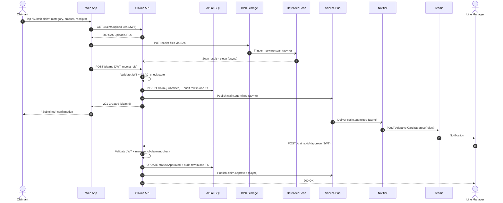
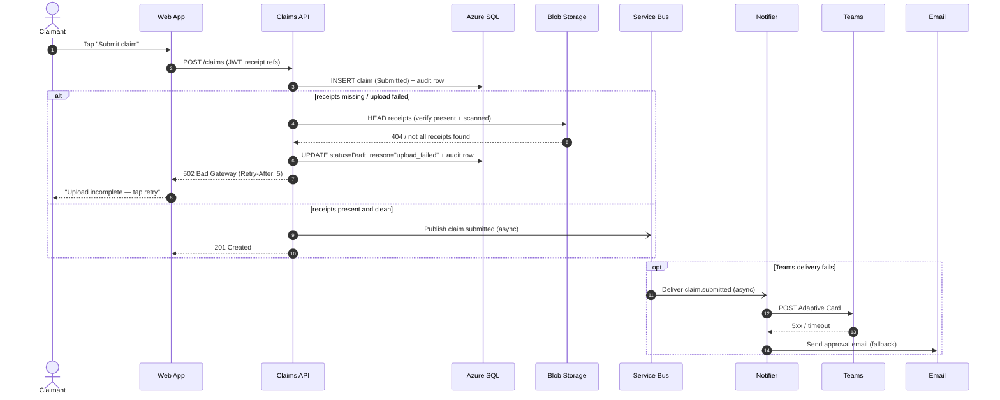

# Sequence — Submit and Approve a Claim

> Lifelines match the **container names** in the architecture pack (Web App, Claims
> API, Azure SQL, Blob Storage, Service Bus, Notifier, Teams). **Sync vs async:**
> `->>` solid = synchronous request, `-->>` dashed = synchronous reply, `-)` open
> arrowhead = **asynchronous** message (Service Bus / scan events).

## Happy path

## Error path — receipt upload fails after the claim was created, + notification fallback

### Notes
- **Receipts use the signed-URL pattern:** the Web App uploads **directly to Blob via
  SAS**, so 10 MB × 5 files never transit the API — protecting the 1.5 s submit SLO.
- **The write is one transaction:** claim row + audit row commit together, so the
  audit log can never disagree with claim state.
- **Notification is asynchronous** (`-)`): a slow/broken Teams webhook never blocks or
  fails the claimant's submit; the Notifier retries and falls back to email.
