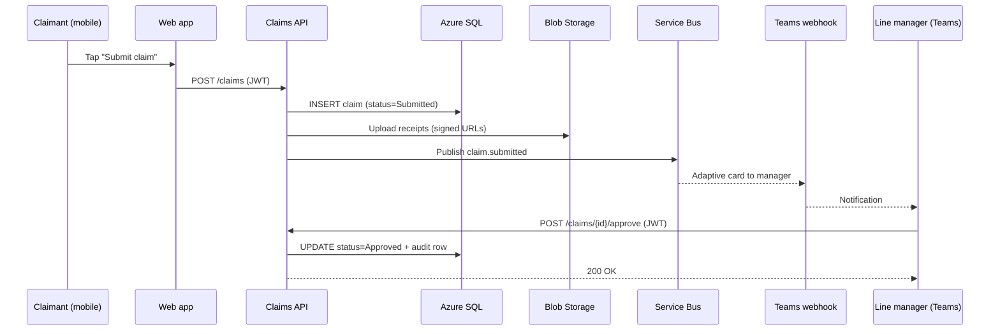
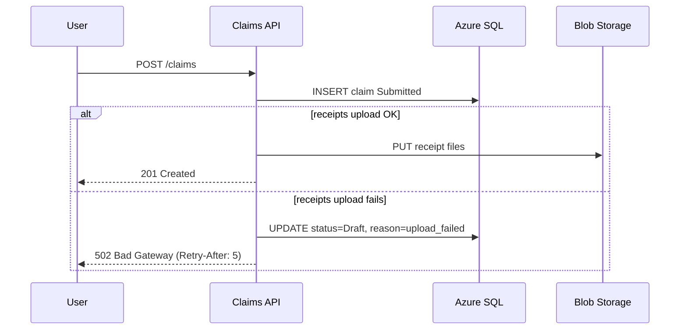

# Day 4 Challenge — GreenChit

## Challenge Overview

GreenChit is an internal BISTEC tool that lets every staff member submit reimbursement claims, attach receipts, and get manager approval before payroll picks them up. Finance has asked for a complete design pack: container and component diagrams, a sequence diagram for the "submit and approve" journey, three ADRs, and a trade-off table comparing two architecture options. You will design review another pair's pack at the end.

- **Time Allocation:** 3 hours (during session)
- **Difficulty:** Intermediate

---

## Business Requirements

### Functional Requirements

- Staff can submit a claim with category, date, amount (LKR), description, and one or more receipt images.
- Staff can see the status of their claims (Draft, Submitted, Approved, Rejected, Paid).
- Line manager receives a notification and can approve, reject, or request more information.
- Finance can export approved claims to a CSV that the payroll system reads.
- Audit log captures every state transition with who, when, and (if rejected) why.

### Non-Functional Requirements

- **Submission round-trip** (tap "Submit" to confirmation): under 1.5 s p95 on the BISTEC office Wi-Fi.
- **Receipt upload:** up to 10 MB per file, up to 5 files per claim, must succeed even with intermittent connectivity.
- **Availability:** 99.9% during business hours (08:00–19:00 Sri Lanka Standard Time, Mon–Fri).
- **Audit log:** tamper-evident; retained for 7 years per company finance policy.
- **Privacy:** only the claimant, the line manager, finance, and the audit role can view a given claim.

### Technical Constraints

- Single sign-on via Microsoft Entra ID (BISTEC tenant).
- Hosting on Azure (App Service or Container Apps — your choice, defended in an ADR).
- Database: Azure SQL or Cosmos DB — your choice, defended in an ADR.
- Receipts: Azure Blob Storage with a signed-URL pattern.
- CSV export: dropped into a SharePoint folder watched by the payroll automation.
- Notifications: Microsoft Teams chat (via Adaptive Card webhook) plus email fallback.

---

## Deliverables

### 1. Container + Component Diagrams (25 points)

**File:** `{your-name}-day4-greenchit-design.md` plus `diagrams/*.png` and `diagrams/*.drawio`

**Required Sections:**

```markdown
# GreenChit — Architecture Design Pack

## 1. System Context (one-paragraph recap of Day 1-style context)
## 2. Containers (C4 Level 2) — embedded PNG + table of containers
## 3. Components (C4 Level 3) for the API service — embedded PNG + table of components
## 4. Reading order — how a reviewer should walk through the diagrams
```

**Evaluation Criteria:**

- Container diagram lists every runtime piece with technology and responsibility (5 pts)
- Component diagram zooms into the API service and shows at least 5 components (auth, claims, receipts, notifications, audit) (5 pts)
- Notation is consistent between Container and Component levels (5 pts)
- Every arrow has a verb-led label and a protocol (5 pts)
- Reading order section walks a reviewer through the diagrams clearly (5 pts)

---

### 2. Sequence Diagram — Submit and Approve (25 points)

**File:** `diagrams/sequence-submit-approve.md` (Mermaid) plus exported `sequence-submit-approve.png`

**Required Content:**

````markdown
# Sequence — Submit and Approve a Claim

## Happy path


## Error path — receipt upload fails after the claim was created
```mermaid
sequenceDiagram
  ...
  alt receipt upload fails
    API->>DB: UPDATE status=Draft + reason="upload_failed"
    API-->>FE: 502 with retry-after
  end
```
````

**Code Requirements:**

- Use Mermaid syntax that renders cleanly in the live editor
- Both happy path AND at least one error fragment included
- Lifelines match container names from the architecture pack (no rename surprises)

**Evaluation Criteria:**

- Happy path is correct end to end including notification and approval (5 pts)
- At least one error path is shown with `alt`/`opt` fragments (5 pts)
- Synchronous and asynchronous interactions distinguished (5 pts)
- Mermaid renders without syntax errors (5 pts)
- Diagram references match container names from the architecture pack (5 pts)

---

### 3. ADR Set (25 points)

**Repository Structure:**

```text
greenchit-design/
├── README.md
├── diagrams/
│   ├── container-diagram.png
│   ├── component-diagram.png
│   └── sequence-submit-approve.md
├── adrs/
│   ├── 0001-record-architecture-decisions.md
│   ├── 0002-hosting-platform.md
│   ├── 0003-database-choice.md
│   └── 0004-receipts-storage-and-virus-scan.md
└── trade-offs/
    └── hosting-options.md
```

**Required ADR Template (Nygard-style):**

```markdown
# ADR 000X: {Decision title}

## Status
Accepted (date: YYYY-MM-DD)

## Context
- Forces at play
- Constraints
- What we don't yet know

## Decision
- The decision in active voice
- Configuration / numbers if relevant

## Consequences
- Easier
- Harder
- Different

## Alternatives considered
- Option B — why we rejected it
- Option C — why we rejected it
```

**Minimum Functionality:**

- [ ] ADR-0001 records the practice of using ADRs (the meta-ADR)
- [ ] ADR-0002 picks App Service or Container Apps with reasoning tied to the trade-off table
- [ ] ADR-0003 picks Azure SQL or Cosmos DB with reasoning tied to data shape and team skills
- [ ] At least one ADR identifies a consequence that is genuinely uncomfortable
- [ ] All ADRs follow the template — no missing sections

**Evaluation Criteria:**

- All required ADRs present, dated, and titled (5 pts)
- Context section captures forces, not just facts (5 pts)
- Consequences section honestly names what becomes harder (5 pts)
- Alternatives section is real — not "we did not consider any" (5 pts)
- ADR voice is decisive ("we choose X"), not equivocating ("we will probably use X") (5 pts)

---

### 4. Trade-off Table + Design Review Feedback (25 points)

**File:** `{your-name}-day4-trade-offs-and-review.md`

**Required Tests/Validations:**

| Quality attribute | Option A: App Service monolith | Option B: Container Apps split | Why |
|-------------------|--------------------------------|--------------------------------|-----|
| Time-to-first-deploy | 5 | 2 | ... |
| Cost (low spend) | 5 | 2 | ... |
| Operability for 10-person team | 4 | 3 | ... |
| Independent deploy | 1 | 5 | ... |
| Future scaling | 2 | 5 | ... |
| Authn/authz consistency | 4 | 3 | ... |
| **Total** | **21** | **20** | ... |

**Report Format:**

```markdown
# GreenChit — Trade-offs and Design Review

## Setup
- Two architectural options under review
- Quality attributes weighted by team / business

## Results Summary
| Metric | Target | Achieved |
|--------|--------|----------|
| Quality attributes scored | 6 | ? |
| Cells with a written justification | 12 | ? |
| Decision-affecting attributes identified | 2-3 | ? |

## Decision and rationale
- Which option won, and which one or two attributes drove the decision

## Design review feedback (received from another pair)
- 3 strengths
- 3 weaknesses or risks
- 2 actionable improvements

## Design review feedback (given to another pair)
- 3 strengths
- 3 weaknesses or risks
- 2 actionable improvements
```

**Evaluation Criteria:**

- All cells in the trade-off table have a written justification (5 pts)
- Decision rationale names the 1–2 attributes that drove it (5 pts)
- Feedback received and given are both completed (5 pts)
- Feedback identifies real risks, not just compliments (5 pts)
- Actionable improvements are specific (file, section, suggested change) (5 pts)

---

## Submission Guidelines

### File Naming Convention

```text
{your-name}-day4-greenchit-design.md
{your-name}-day4-greenchit-design/  (zipped repository)
{your-name}-day4-trade-offs-and-review.md
```

### Submission Checklist

- [ ] Container + Component diagrams exported and embedded
- [ ] Sequence diagram in Mermaid + PNG renders correctly
- [ ] At least 4 ADRs present and dated
- [ ] Trade-off table fully justified
- [ ] Received and given design review notes filed in the same doc

---

## Scoring Guide

| Grade | Score | Description |
|-------|-------|-------------|
| Exceptional | 90–100 | Could be handed to a tech lead as a starting point for a real BISTEC project; ADRs are decisive and honest |
| Proficient | 75–89 | Diagrams consistent and readable; ADRs follow template with real alternatives; trade-offs justified |
| Developing | 60–74 | Diagrams have notation drift; ADRs short of consequences or alternatives; trade-off scores without justification |
| Beginning | <60 | Diagrams missing levels; ADRs are headings without content; no real review feedback |

**Passing Score:** 75%

---

## Hints and Tips

### Mermaid sequence with happy path AND error fragment



### A short, decision-grade ADR

```markdown
# ADR 0002: Host GreenChit on Azure App Service (single web app)

## Status
Accepted (2026-05-05)

## Context
- 10-person team with limited container/IaC experience
- Hard deadline: working internal release in 6 weeks
- Expected concurrency: < 50 staff submissions per peak hour
- Strong preference for Azure-native managed services

## Decision
We host GreenChit as a single ASP.NET Core web app on Azure App Service (Premium V3, P1v3),
with deployment slots for staging and production. We treat horizontal scale-out and a future
split into services as ADR-0009 once usage exceeds 200 RPS or independent-deploy needs arise.

## Consequences
- Easier: faster first deploy, simpler observability, single CI pipeline
- Harder: any change requires redeploying everything; per-feature scaling not possible
- Different: team will not learn container patterns inside this project (mitigation: cross-train via PoC)

## Alternatives considered
- Azure Container Apps (split web + workers): rejected because the team velocity hit
  for IaC + container build tooling outweighs the expected scaling benefit at this scale.
- Azure Functions only: rejected because of the long-tail receipt-upload latency profile.
```

### Trade-off scoring is an argument tool, not a calculator

Don't let the highest total win automatically. Identify which 1–2 attributes the business cares about most, mark them clearly, and decide on those. Note this explicitly in the decision rationale.
